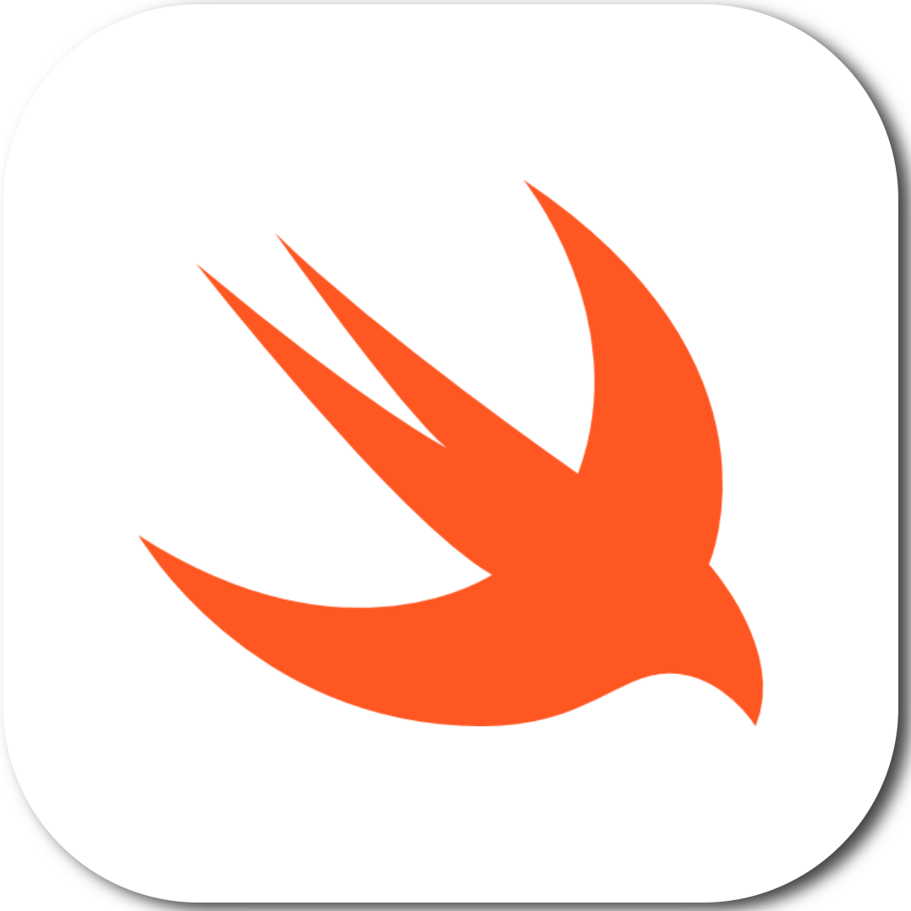
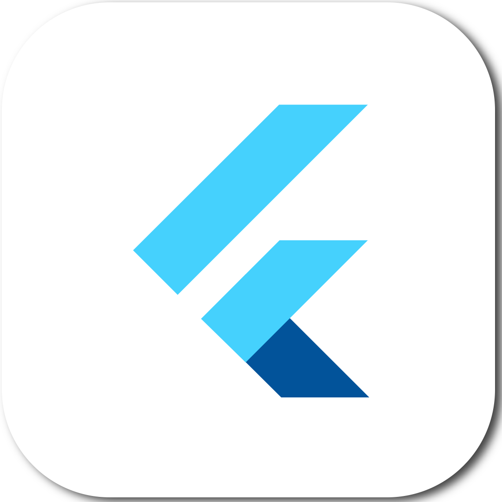
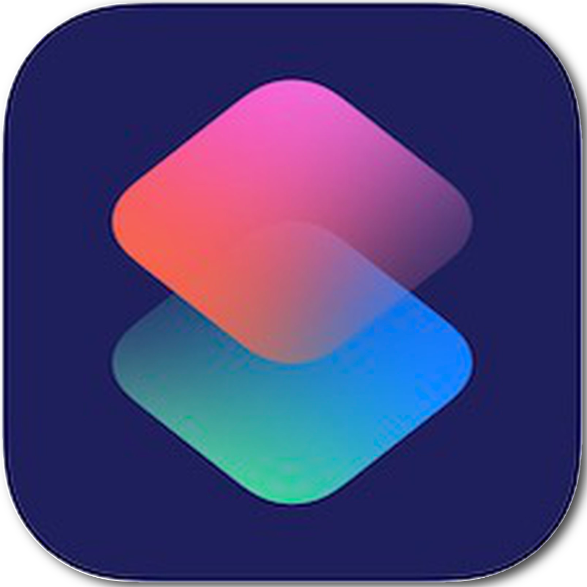
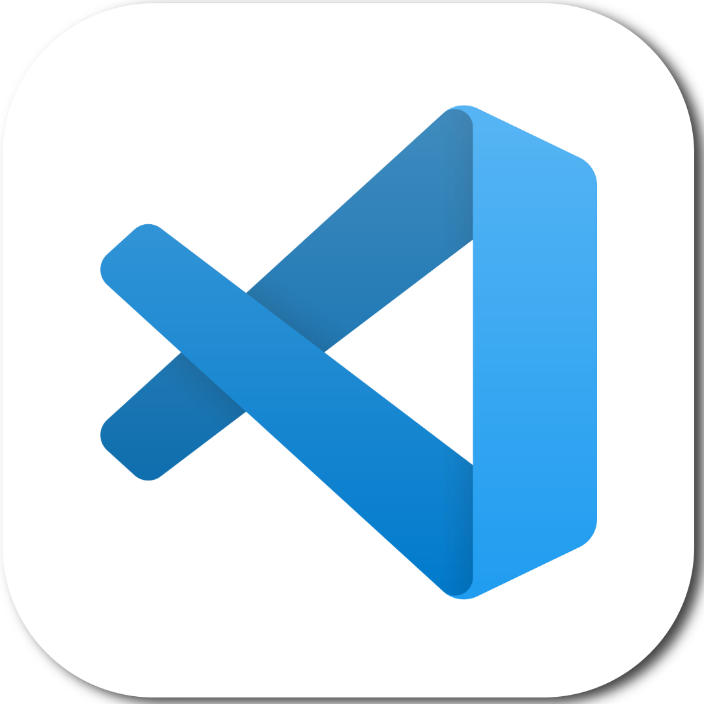
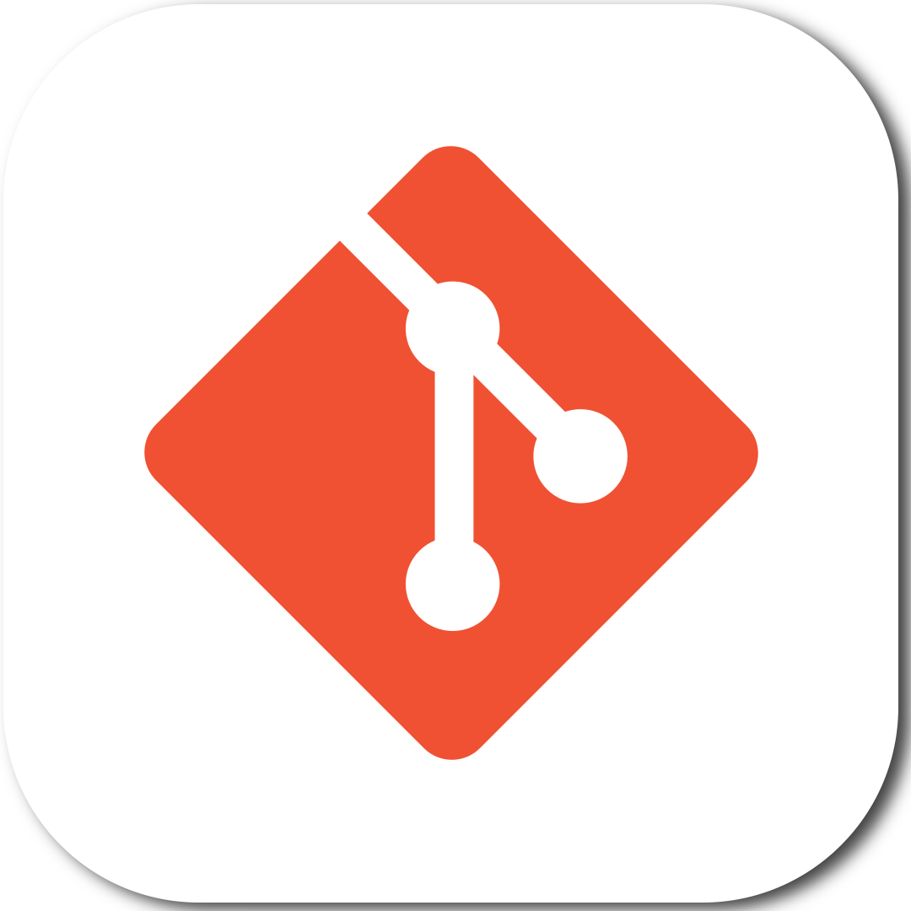
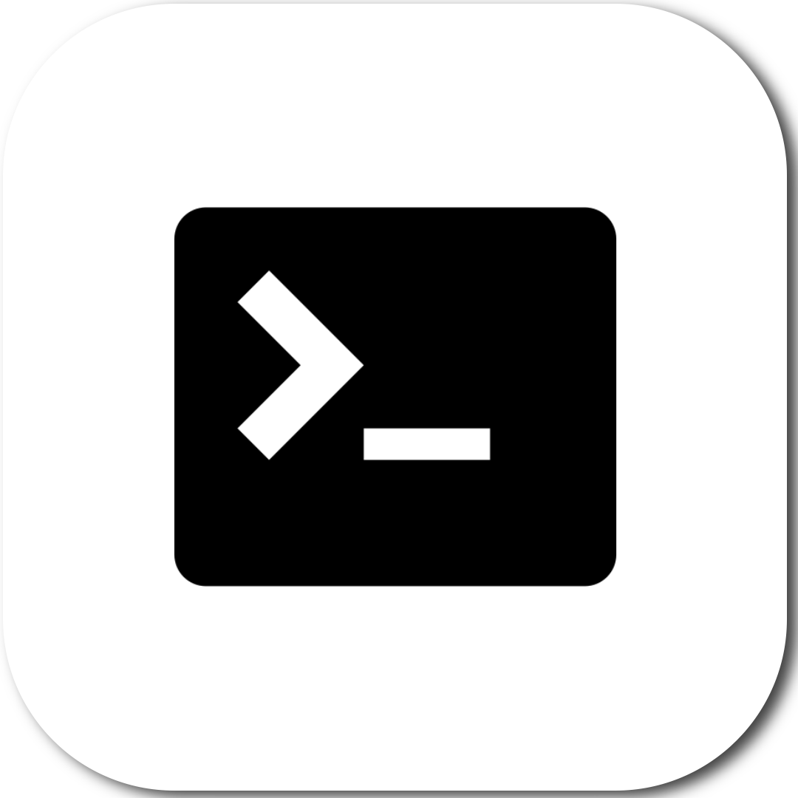

### Hi there, I'm Gleb Osotov 👋

## I'm a Student and a Developer

### Connect with me:

[][telegram]
[][youtube]
[][twitter]
[][linkedin]
[][instagram]

 

### Languages and Tools:

)

 
 

[twitter]: https://twitter.com/glebosotov
[telegram]: https://t.me/glebosotov
[youtube]: https://www.youtube.com/channel/UCfF0_M1nJmGHQbhQx9Z21Rg
[instagram]: https://instagram.com/glebosotov
[linkedin]: https://linkedin.com/in/glebosotov